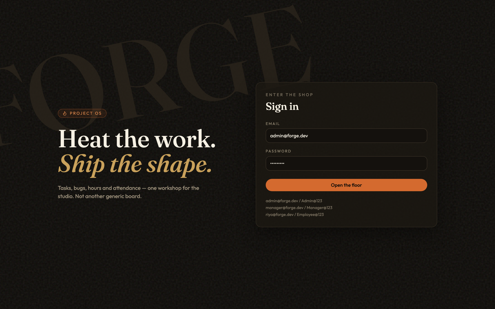
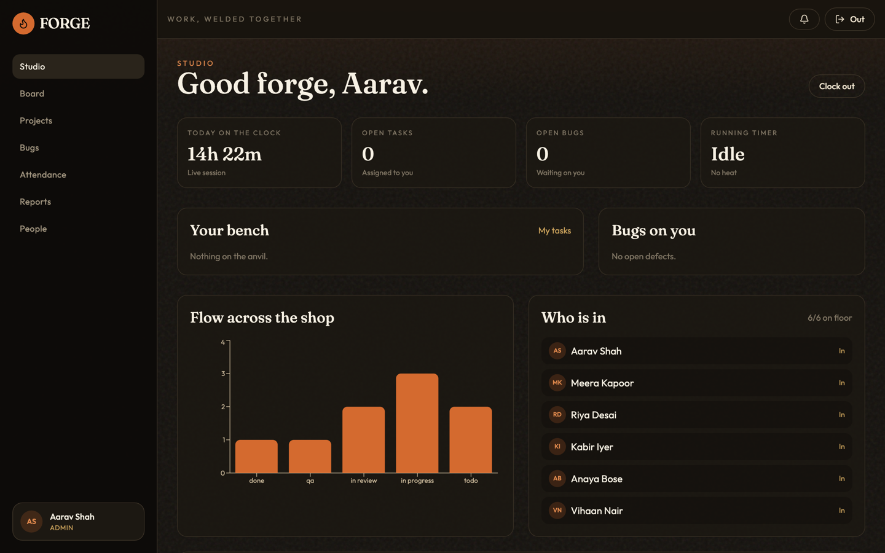
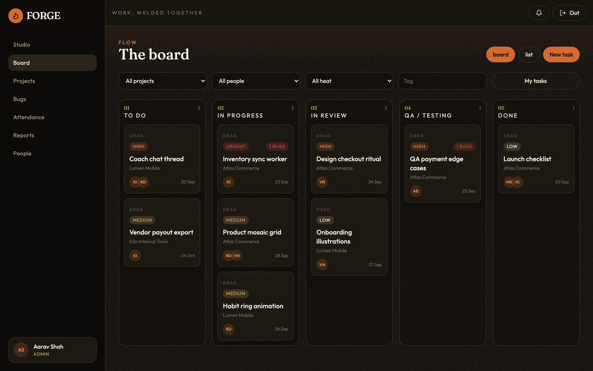
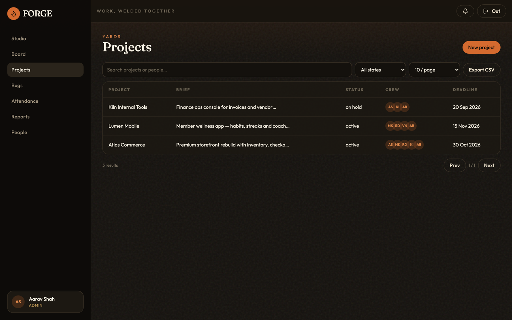
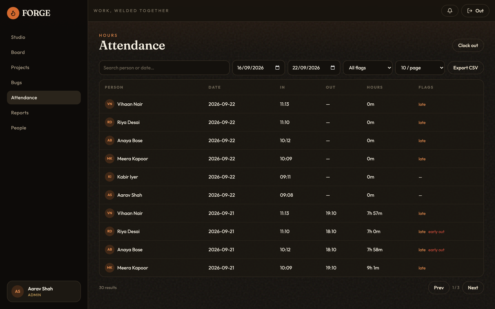
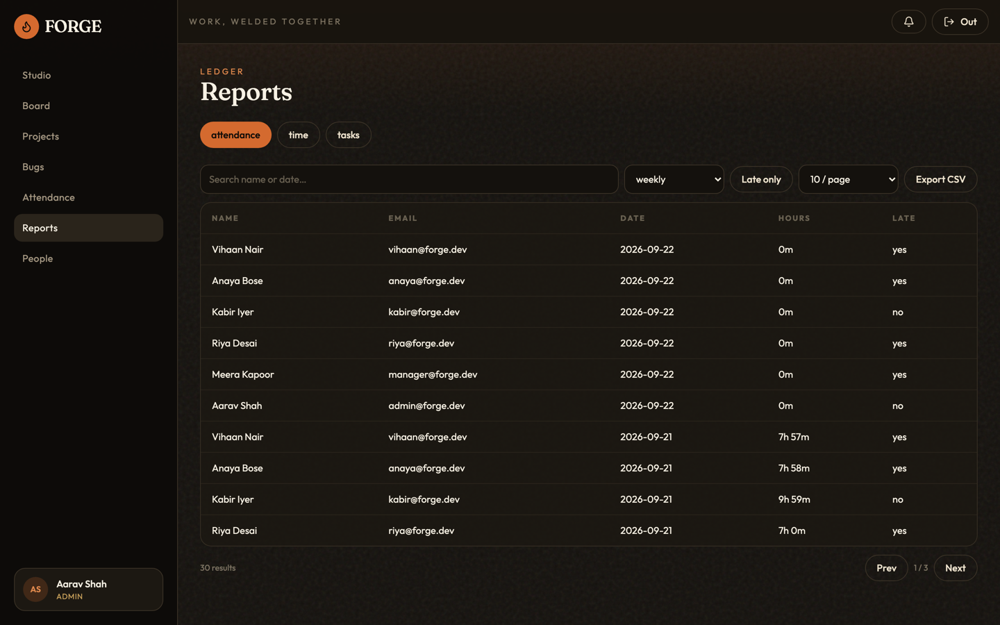
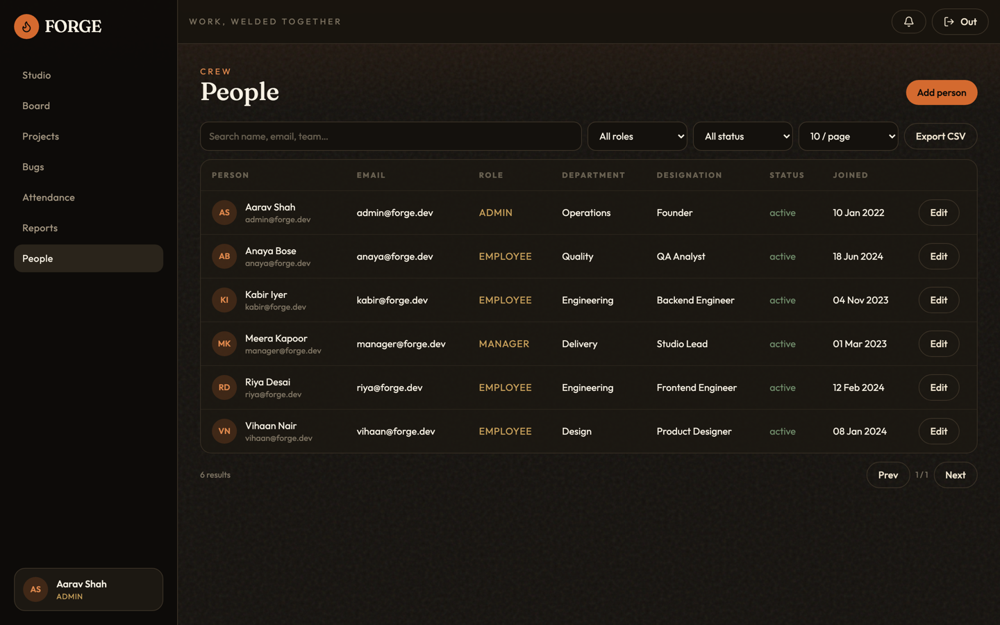
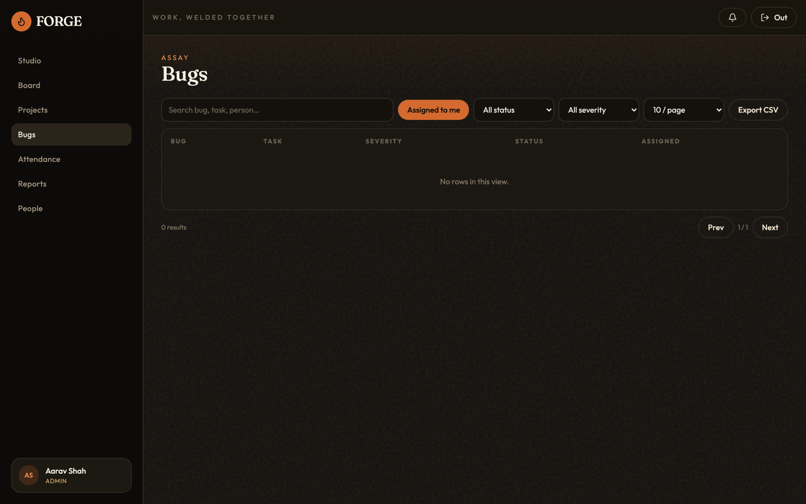

# FORGE — Project Management System

Internal project / task OS: Kanban, QA bugs, attendance, and task-wise time tracking.

**Stack:** Node.js + Express + MongoDB · React + Vite + Tailwind

## Screenshots

### Sign in



### Studio dashboard



### Kanban board



### Projects



### Attendance



### Reports



### People



### Bugs



## Quick start

1. Install [MongoDB](https://www.mongodb.com/docs/manual/installation/) and start it locally.
2. Install dependencies:

```bash
cd backend && npm install
cd ../frontend && npm install
```

3. Copy env if needed (`backend/.env` is already set for local Mongo):

```
MONGO_URI=mongodb://127.0.0.1:27017/forge_pms
```

4. Create collections + indexes, then load demo data:

```bash
cd backend
npm run migrate
npm run seed
```

5. Run both apps:

```bash
# terminal 1
cd backend && npm run dev

# terminal 2
cd frontend && npm run dev
```

Open [http://localhost:5180](http://localhost:5180). API runs on port **5060**.

## Docker (optional)

Needs [Docker Desktop](https://docs.docker.com/get-docker/) (or Docker Engine + Compose). This starts MongoDB, the API, and the web app.

```bash
docker compose up --build
```

Or: `npm run docker:up`

Then open [http://localhost:5180](http://localhost:5180). First boot runs migrations and seeds demo users if the database is empty.

| Service | Port |
|---|---|
| Web | 5180 |
| API | 5060 |
| MongoDB | 27017 |

Useful commands:

```bash
# background
docker compose up --build -d

# only Mongo (keep using local npm run dev)
docker compose up -d mongo

# stop containers (data stays)
docker compose down

# wipe database + uploads
docker compose down -v
```

If port **27017** is already used by a local Mongo, stop that process or change the mongo port in `docker-compose.yml`.

To skip seeding: `SEED_ON_START=false docker compose up --build`

## Demo accounts

| Role | Email | Password |
|---|---|---|
| Admin | admin@forge.dev | Admin@123 |
| Manager | manager@forge.dev | Manager@123 |
| Employee | riya@forge.dev | Employee@123 |

Also: `kabir@forge.dev`, `anaya@forge.dev`, `vihaan@forge.dev` / `Employee@123`

## Phases shipped

1. Auth, JWT, RBAC, employee management
2. Projects, tasks, comments, activity
3. Kanban drag-and-drop, list / my-tasks views
4. Bugs linked to tasks
5. Clock in / out + late / early flags
6. Task timer + manual time
7. Dashboards, CSV reports, in-app notifications
8. MongoDB migration files for every collection

## Migrations

`backend/src/migrations/` creates collections with JSON schema validators and indexes:

- users, projects, tasks, comments, bugs
- attendances, timeentries, notifications, activities
- schema_migrations

## API

Base: `http://localhost:5060/api`

Auth header: `Authorization: Bearer <token>`
